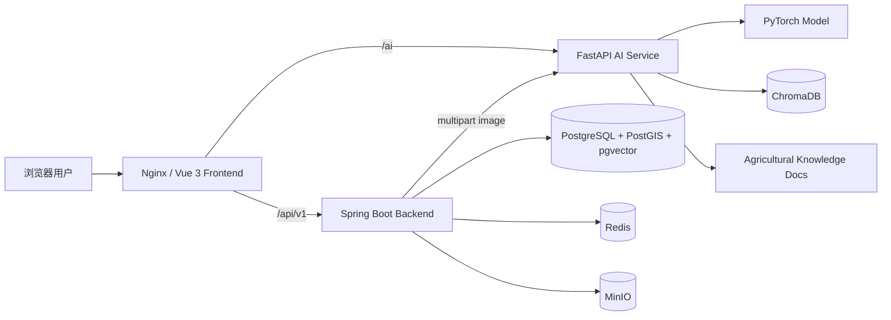
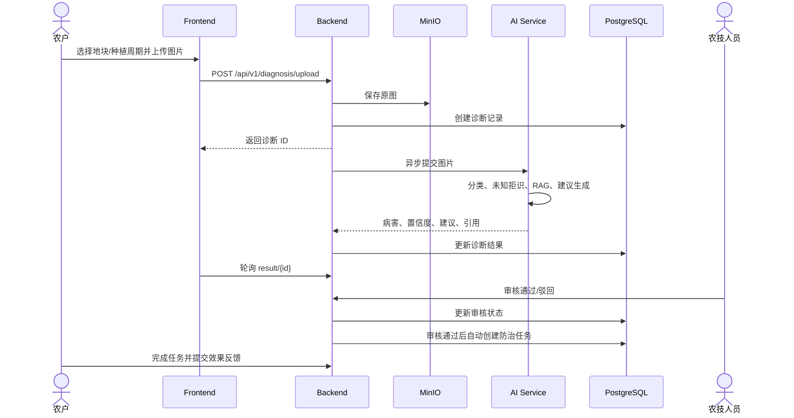

# 系统架构说明

## 1. 总体架构



外部只需要访问 `http://localhost`。Nginx 将 `/api` 转发到 Backend、将 `/ai` 转发到 AI 服务；数据库、Redis、MinIO 和内部服务端口不直接暴露给浏览器。

## 2. 代码结构

| 目录 | 职责 |
|---|---|
| `frontend/` | Vue 3 页面、路由、Pinia 状态、API 请求和组件测试 |
| `backend/` | 认证、业务规则、数据访问、MinIO、AI 编排、定时任务 |
| `ai-service/` | 图像推理、未知拒识、RAG、Agent 建议、模型评测 |
| `data-pipeline/` | 可独立运行的数据采集脚本 |
| `deploy/` | Docker Compose、Nginx、PostgreSQL 初始化与环境示例 |
| `tests/` | 跨服务集成测试 |
| `docs/` | 课程交付文档与关键验收证据 |

## 3. 诊断时序



## 4. Backend 分层

```text
Controller → Service → Mapper → PostgreSQL
                  ├→ MinIO
                  ├→ Redis
                  └→ AI Service
```

- Controller 负责参数接收、鉴权上下文和统一响应。
- Service 负责资源归属、状态流转和业务事务。
- Mapper 使用 MyBatis-Plus 访问数据。
- Flyway migration 是数据库结构和演示数据的唯一版本来源。

## 5. AI 服务设计

1. `InferenceService` 加载模型和 `class_to_idx.pth`。
2. 图像预处理后执行分类，并根据阈值处理未知样本。
3. `RAGService` 从 `knowledge_docs/` 构建或加载 Chroma 向量库。
4. `AgentService` 组合诊断、天气、生育期和引用，生成防治建议。
5. 所有相对路径统一锚定 `ai-service/`，Docker 中使用 `/app` 绝对路径。

## 6. 数据与存储

- PostgreSQL：用户、农场、地块、种植周期、诊断、审核、任务、天气、市场、模型等结构化数据。
- MinIO：病害原始图片。
- Redis：缓存和运行期辅助数据。
- ChromaDB：RAG 向量索引。
- `knowledge_docs/`：可追溯的农业规范文本。

## 7. 安全设计

- Spring Security + JWT 完成认证。
- 角色权限与资源所有权同时校验，避免 IDOR。
- 上传文件经后端验证后进入对象存储。
- 外部密钥只从环境变量读取，仓库只提交 `.env.example`。
- 统一异常响应避免将内部堆栈直接返回前端。

## 8. 部署与健康检查

```powershell
docker compose -f deploy/docker-compose.yml up -d --build
docker compose -f deploy/docker-compose.yml ps
```

Compose 包含：`frontend`、`backend`、`ai-service`、`postgres`、`redis`、`minio`。服务通过 healthcheck 控制启动顺序，且不会因停止或重建自动删除数据库 volume。
