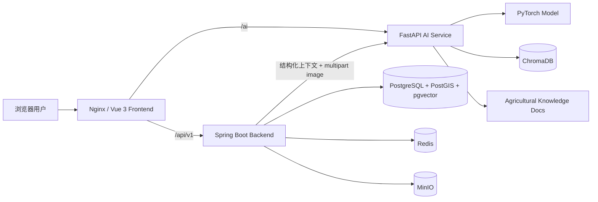
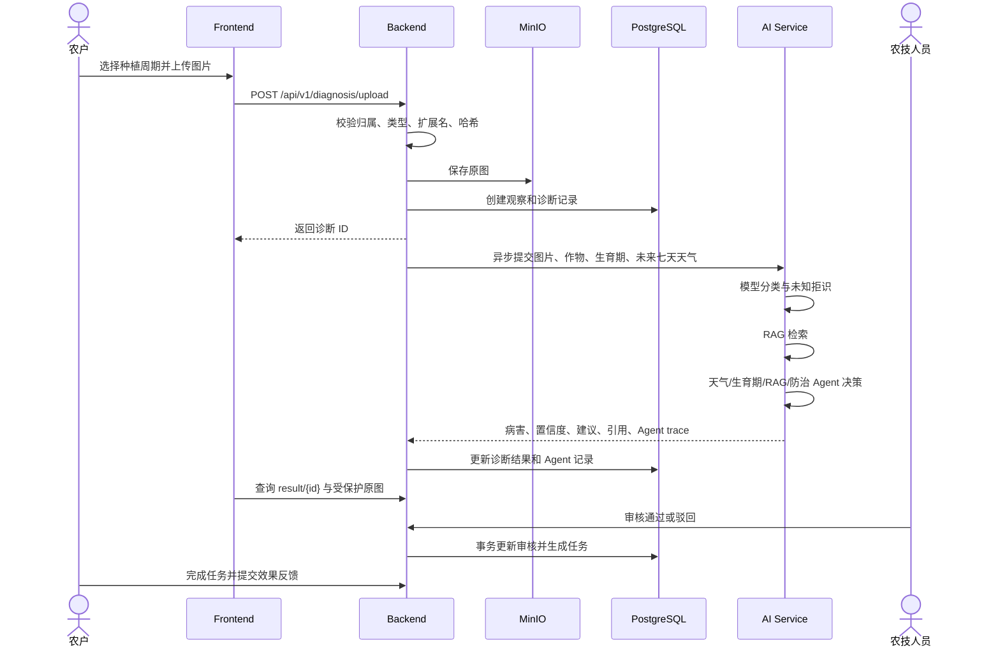
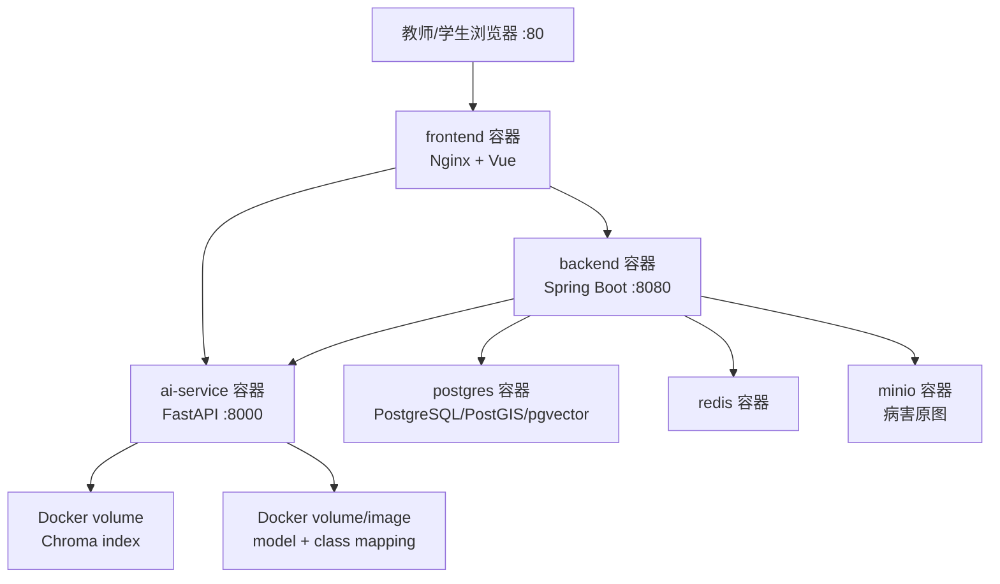

# 系统设计说明书

## 1. 总体架构图



Spring Boot 是业务数据 source of truth，FastAPI 只负责模型推理、RAG 与 Agent。外部统一访问 `http://localhost`，数据库和内部服务不直接暴露给浏览器。

## 2. 代码结构

| 目录 | 职责 |
|---|---|
| `frontend/` | Vue 3 页面、路由、Pinia、API 请求和组件测试 |
| `backend/` | 认证、业务规则、事务、数据访问、MinIO、AI 编排、定时任务 |
| `ai-service/` | 图像推理、未知拒识、RAG、四 Agent、模型评测 |
| `data-pipeline/` | 可独立运行的数据采集脚本 |
| `deploy/` | Docker Compose、Nginx、PostgreSQL 与环境示例 |
| `tests/` | 跨服务集成测试和性能冒烟测试 |
| `docs/` | 课程交付文档与验收证据 |

## 3. ER 图

```mermaid
erDiagram
    USERS ||--o{ FARMS : owns
    FARMS ||--o{ FIELDS : contains
    FIELDS ||--o{ PLANTING_CYCLES : has
    CROPS ||--o{ PLANTING_CYCLES : planted_as
    USERS ||--o{ PLANTING_CYCLES : creates
    PLANTING_CYCLES ||--o{ OBSERVATIONS : records
    USERS ||--o{ OBSERVATIONS : reports
    OBSERVATIONS ||--|| DIAGNOSIS_RECORDS : produces
    USERS ||--o{ DIAGNOSIS_RECORDS : reviews
    DIAGNOSIS_RECORDS ||--o| REVIEW_QUEUE : queued_as
    USERS ||--o{ REVIEW_QUEUE : assigned_to
    DIAGNOSIS_RECORDS ||--o{ AGENT_RUNS : executes
    DIAGNOSIS_RECORDS ||--o{ FARMING_TASKS : generates
    PLANTING_CYCLES ||--o{ FARMING_TASKS : schedules
    USERS ||--o{ FARMING_TASKS : performs
    FARMS ||--o{ WEATHER_RECORDS : has
    CROPS ||--o{ MARKET_PRICES : priced_as
    USERS ||--o{ KNOWLEDGE_DOCUMENTS : authors

    USERS { uuid id PK string username UK string role }
    FARMS { uuid id PK uuid owner_id FK string name }
    FIELDS { uuid id PK uuid farm_id FK string name }
    CROPS { uuid id PK string name string variety }
    PLANTING_CYCLES { uuid id PK uuid field_id FK uuid crop_id FK string growth_stage }
    OBSERVATIONS { uuid id PK uuid cycle_id FK uuid user_id FK json images }
    DIAGNOSIS_RECORDS { uuid id PK uuid observation_id FK string image_hash UK string review_status }
    REVIEW_QUEUE { uuid id PK uuid diagnosis_id FK_UK uuid assigned_to FK }
    AGENT_RUNS { uuid id PK uuid diagnosis_id FK string status }
    FARMING_TASKS { uuid id PK uuid diagnosis_id FK uuid assignee_id FK string status }
```

完整字段、约束和索引见 [database-design.md](database-design.md) 与 Flyway migration。

## 4. 诊断时序图



## 5. Backend 分层与事务

```text
Controller → Service → Mapper → PostgreSQL
                  ├→ MinIO
                  ├→ Redis
                  └→ AI Service
```

- Controller 接收参数、获取身份并返回统一响应。
- Service 校验资源归属、状态流转和事务边界。
- Mapper 使用 MyBatis-Plus；Flyway 是数据库结构唯一版本来源。
- 认证注册、知识发布/同步、模型部署、天气批量刷新和“审核通过—生成任务”等多写操作使用 `@Transactional`。

## 6. AI 服务与 Agent 设计

1. `InferenceService` 加载模型和类别映射，输出 18 类预测、置信度与未知拒识结果。
2. Backend 查询真实作物、品种、生育期、地块、农场和未来七天天气，结构化发送给 AI。
3. `RAGService` 从已发布知识文档构建/加载 Chroma 向量库并返回引用。
4. Agent 分为天气风险、生育期、RAG 知识和防治决策四步；结果写入 `agent_runs` 并在农技详情页展示。
5. 模型 Runtime 与知识状态由管理页面通过 Backend 真实接口查询和同步。

## 7. 部署图



启动命令：

```powershell
docker compose -f deploy/docker-compose.yml up -d --build
```

Compose 包含 `frontend`、`backend`、`ai-service`、`postgres`、`redis`、`minio` 六个服务，并通过 healthcheck 管理依赖启动顺序。

## 8. 安全与故障处理

- Spring Security + JWT + 方法级 `@PreAuthorize` 完成认证授权；Service 再校验资源所有权，降低 IDOR 风险。
- 图片路径不直接公开，通过 Backend 鉴权后从 MinIO 读取。
- 外部密钥只从环境变量读取；统一异常响应不暴露内部堆栈。
- AI/LLM 不可用时保留待审核状态或使用确定性建议，人工审核是最终控制点。