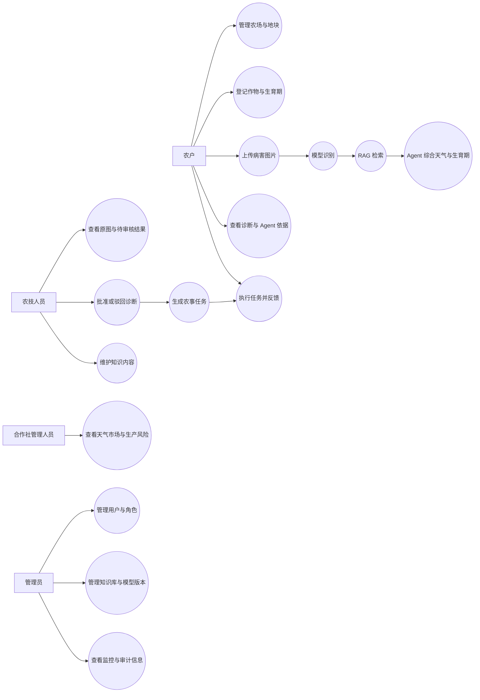

# 需求规格说明书

## 1. 项目目标

建设面向云南特色农业的智能诊断与生产管理平台，将农场地块、种植档案、病害图片、AI 识别、RAG 农技规范、多 Agent 决策、农技审核、防治任务和效果反馈连接为可演示的业务闭环。

## 2. 用户角色

| 角色 | 主要职责 |
|---|---|
| 农户（Farmer） | 管理自己的农场、地块和种植周期；上传病害图片；查看诊断；执行任务并反馈效果 |
| 农技人员（Technician） | 查看待审核诊断、检查原图与 AI 建议、完成人工审核、维护知识内容 |
| 合作社管理人员（Coop Manager） | 查看生产概览、未来天气、市场行情和区域风险 |
| 系统管理员（Admin） | 管理用户、角色、模型版本、知识文档和系统状态 |

## 3. 用户故事

| 编号 | 用户故事 | 验收条件 |
|---|---|---|
| US-01 | 作为农户，我希望建立农场、地块和种植周期，以便记录真实生产对象。 | 只能管理本人资源；可选择多种作物和生育期；空农场时可直接新建农场。 |
| US-02 | 作为农户，我希望点击或拖拽上传病害图片，以便获得诊断建议。 | Backend 校验图片类型、扩展名、大小与种植周期归属；重复图片被拒绝。 |
| US-03 | 作为农户，我希望查看识别结果、原图、引用和 Agent 依据，以便理解建议来源。 | 显示病害、置信度、严重程度、未来七天天气、生育期、四个 Agent 轨迹和 RAG 引用。 |
| US-04 | 作为农技人员，我希望查看待审核图片和建议并批准或驳回，以便控制 AI 风险。 | 可读取受保护原图；审核状态合法；批准后自动生成农事任务。 |
| US-05 | 作为农户，我希望完成任务并反馈处置效果，以便形成可追踪闭环。 | 任务仅由执行人流转；反馈与原诊断关联。 |
| US-06 | 作为合作社管理人员，我希望查看天气、市场和生产风险，以便安排生产。 | 展示当天起未来七天天气、市场趋势和生产概览，可手动更新天气。 |
| US-07 | 作为管理员，我希望管理真实知识文档和模型版本，以便控制 AI 运行资产。 | 知识可发布/同步/归档；模型可登记/部署；页面显示当前 Runtime。 |

## 4. 用例图



## 5. 核心业务闭环

```text
建立农场/地块 → 登记作物和生育期 → 上传异常图片 → 模型识别
→ RAG 检索农技规范 → Agent 综合天气与生育期 → 农技人员审核
→ 生成农事任务 → 跟踪处置效果
```

## 6. 功能需求

| 模块 | 必需能力 | 当前实现 |
|---|---|---|
| 登录与权限 | 登录、JWT 鉴权、角色路由、资源归属校验 | 已实现 |
| 农场与地块 | 新建农场、地块 CRUD、只访问授权资源 | 已实现 |
| 种植档案 | 作物与种植周期创建、修改、删除和查询 | 已实现 |
| 病害上报 | 点击/拖拽上传、图片存储、类型校验、重复检测、异步诊断 | 已实现 |
| AI 诊断 | 18 类分类、未知样本拒识、置信度、严重程度 | 已实现 |
| RAG 与 Agent | 检索农业知识，综合未来天气、生育期和病害生成可审核建议 | 已实现 |
| 人工审核 | 查看原图、诊断详情、批准或驳回 | 已实现 |
| 农事任务 | 审核通过自动建任务、任务状态流转、效果反馈 | 已实现 |
| 天气与市场 | 未来七天天气、手动更新、市场趋势 | 已实现 |
| 管理与监控 | 用户、模型、知识库、Agent 记录和基础指标管理 | 已实现课程演示范围 |
| 一键部署 | Docker Compose 启动 Frontend、Backend、AI、DB、Redis、MinIO | 已实现 |

## 7. 数据需求

- 业务数据由 PostgreSQL 保存，数据库结构通过 Flyway migration 管理。
- 图片保存在 MinIO，数据库只保存对象路径、SHA-256 和业务元数据。
- Redis 用于缓存和运行期辅助状态；ChromaDB 保存 RAG 向量索引。
- AI 模型、类别映射和知识文档位于 `ai-service/`，模型版本与知识状态同步到 Backend。
- 训练和验证数据只用于课程研究与演示，不宣称具备生产级泛化能力。

## 8. 非功能需求

### 8.1 安全与合规

- 未登录请求必须被拒绝，角色权限和资源所有权同时校验。
- 密码使用 BCrypt；JWT Secret 和外部 API Key 通过环境变量配置。
- 上传文件校验空文件、MIME、扩展名、大小、重复哈希和业务归属。
- 关键写操作通过 `@AuditLog` 记录操作人、动作、结果和耗时。
- 课程数据不包含真实身份证号、银行卡、精确个人住址等敏感信息。

### 8.2 可用性

- 空数据展示明确空状态，不出现白屏。
- 网络失败、AI 失败、对象存储失败和无效输入有可理解提示。
- 表单提交期间防止重复操作。
- AI 无外部 LLM Key 时仍提供带真实 RAG 引用的确定性建议。

### 8.3 性能与可维护性

- Frontend、Backend、AI 服务解耦，接口统一使用 `/api/v1`。
- 路径从服务根目录或环境变量解析，不依赖开发者电脑路径。
- 常用查询具有普通索引、组合索引、PostGIS GIST 索引或向量索引。
- 核心逻辑具备自动化测试；课程验收级 API 冒烟测试要求成功率 100%，不宣称生产级 QPS/P95。

## 9. 验收标准

1. Docker Compose 六个服务全部 healthy。
2. 四类账号可以登录并进入对应页面。
3. 完整演示一次“建档—上传—AI/RAG/Agent—审核—任务—反馈”。
4. Frontend、Backend、AI、接口、数据库和性能验证通过。
5. Swagger、健康检查、关键页面和受保护图片均可访问。
6. 提供需求、设计、接口、数据库、测试、安全和协作材料。

详细结果见 [testing-and-acceptance.md](testing-and-acceptance.md)。